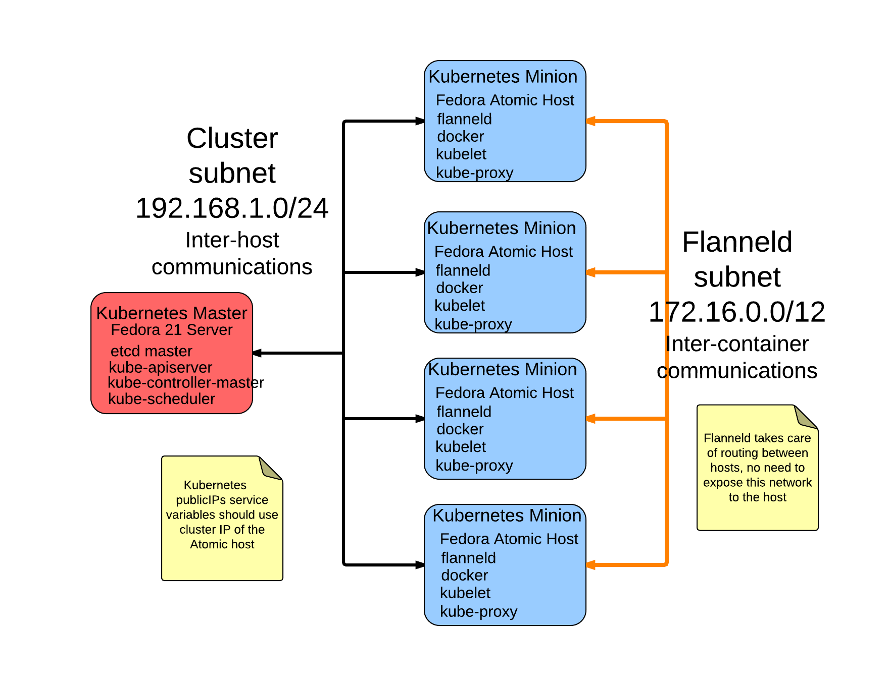

# Creating an Atomic fleet using Ansible

This is a blunt stick to create a set of Atomic hosts in a Kubernetes cluster from a Fedora 21 Server using Ansible.  Docker is configured to use Flannel for container networking.  I started with the eparis ansible kubernetes repo [https://github.com/eparis/kubernetes-ansible] as an example and there are some remnants of that code.  I expect to change / remove most of that in the near future.  

Right now, I've used this for testing in a local KVM (virt-manager) environment and in EC2.

This is a high level (and poor) diagram of the components.

## To use this playbook:

* Build an F21 Server, copy the mconf.sh script to the Server
* Create the Atomic hosts
* Modify the inventory to reflect the IPs of the environment, master and etcd are the F21 server
* Update the group_vars/master.yml and minions.tml to reflect any needed changes
* Run 'ansible -i inventory all -m ping' to make sure ansible can ssh to all the systems
* Run the toplevel fleet.yml playbook
** ansible-playbook -i inventory fleet.yml --tags ssh -k (Deploy ssh keys, will ask for ssh password)
** ansible-playbook -i inventory fleet.yml --tags prerun,common (Run common and setup tasks tagged with prerun)
** ansible-playbook -i inventory fleet.yml --skip-tags prerun,ssh (Run everything but the setup and ssh tasks, add kubeguest,kubedns to the skip list to not deploy those pods)
* Run 'kubectl get minions'
* ???
* Profit!

## TODO:

* Assumes that masters are F21 and minions are Atomic, add OS detection to make cleaner
* Add CentOS, RHEL support cleanly
